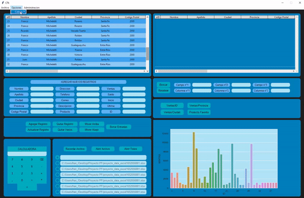
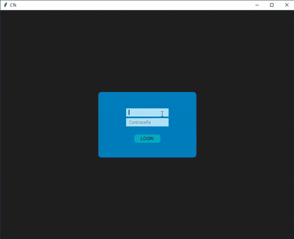

# DATA MANAGEMENT AND VISUALIZATION APP

LIBRARIES USED:

  - Datetime
  - Tkinter
  - Matplotlib
  - SQLite3
  - Os
  - Seaborn
  - Pandas

## COLOR THEMES

## LOGIN WINDOW

Users log in with their username and password. This information exists in a database and is compared with the information that the user entered in the text input. By default, an administrator user must exist to be able to change, modify or create new users. This can be changed for different purposes.

## RECORDS'S TABLE

It's the table connected directly with the database and shows real time information.

 ## DATABASE MANAGEMENT
 
 Used to Modify, move or delete records

